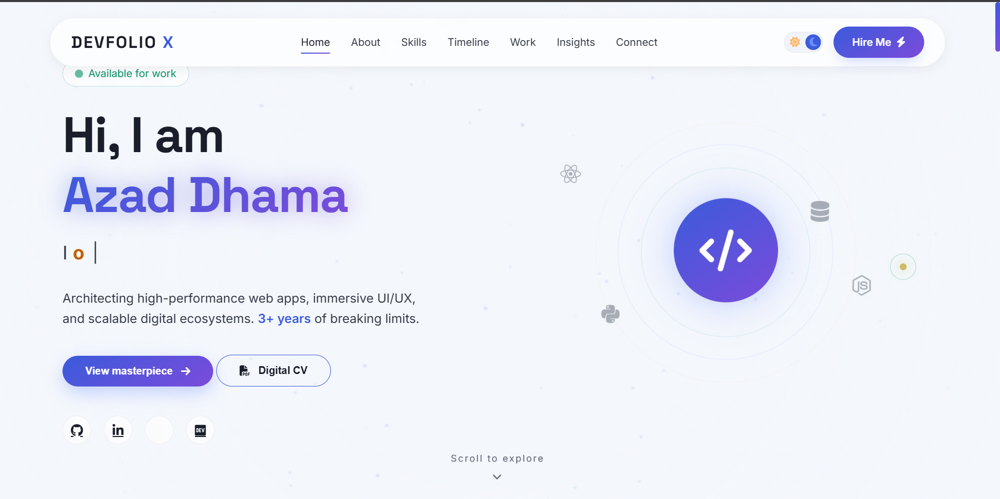
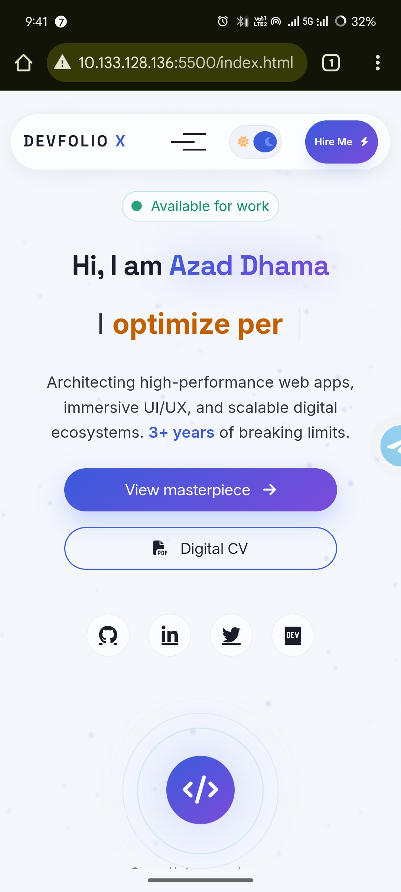

# DevFolio X – Hyper‑Modern Developer Portfolio



DevFolio X is a cutting‑edge, fully responsive portfolio template designed for developers who want to showcase their work with style. It features a futuristic glass‑morphism aesthetic, interactive UI components, smooth animations, and a seamless mobile experience.

🔗 **Live Demo:** [https://yourusername.github.io/devfolio-x](https://yourusername.github.io/devfolio-x)

---

## ✨ Features

- **Dual‑theme** – Smooth toggle between dark and light mode (preference saved in `localStorage`).
- **Custom cursor** – A beautiful, interactive cursor that scales on hover (desktop only).
- **Particle background** – Subtle animated canvas particles that adapt to the theme.
- **Typed text effect** – Dynamic hero headline with a typing animation.
- **Scroll‑spy navigation** – Active section highlight in the navbar as you scroll.
- **Project filter** – Filter your work by category without page reload.
- **Skill bars** – Animated progress bars that fill when scrolled into view.
- **Magnetic buttons** – Fun, interactive buttons that follow the mouse (desktop only).
- **Mobile menu** – Smooth slide‑in menu with backdrop blur and scroll lock.
- **Fully responsive** – Pixel‑perfect on all devices (phones, tablets, desktops).
- **Loader animation** – Simulated loading progress for a polished first impression.
- **Back to top** – Floating button appears after scrolling.

---

## 🛠️ Technologies Used

- **HTML5** – Semantic, accessible markup.
- **CSS3** – Custom properties, flexbox, grid, animations, media queries.
- **JavaScript (ES6)** – Modular, vanilla JS (no frameworks).
- **Font Awesome 6** – Icons.
- **Google Fonts** – Inter & Space Grotesk.
- **GSAP** – (Included for future enhancements, optional).

---

## 📸 Screenshots

| Desktop | Mobile |
|---------|--------|
|  |  |

---

## Customise
- Replace placeholder text, images, and links with your own content.

- Update the data-count attributes in stats to your actual numbers.

- Change the data-percent attributes in skill items to your proficiency levels.

- Add your own projects in the .projects-grid section.

- Update social media links and email address in the contact section.

- Replace the favicon (optional).

***

## 🧩 File Structure
```
devfolio-x/
├── index.html          # Main HTML file
├── style.css           # All styles
├── logic.js            # All JavaScript
├── images/
│   ├── desktop-preview.png
│   └── mobile-preview.jpg
└── README.md
```

***

## 🌗 Theme Toggle
The theme preference is stored in localStorage. When a user switches themes, the selection persists across page reloads. The particle color and all accent colors adapt automatically.

*** 

## 📱 Mobile Optimisations
Touch targets – All interactive elements have a minimum size of 44×44 pixels.

Hover effects – Disabled on touch devices to prevent sticky hover.

Custom cursor – Hidden on touch devices.

Mobile menu – Opens from the right with a backdrop and body scroll lock.

Cards and text – Re‑spaced for comfortable reading on small screens.

***

## ⚡ Performance
No external dependencies except Font Awesome and Google Fonts.

Optimised animations using requestAnimationFrame for particles.

Smooth transitions with cubic-bezier easing.

Minimal reflows – transforms and opacity used where possible.

***

## 👨‍💻 Author
Azad Dhama